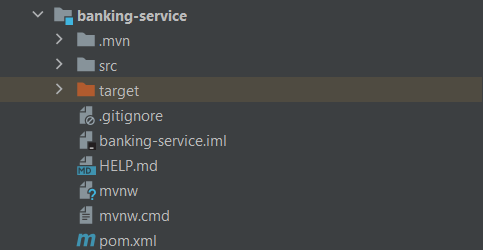
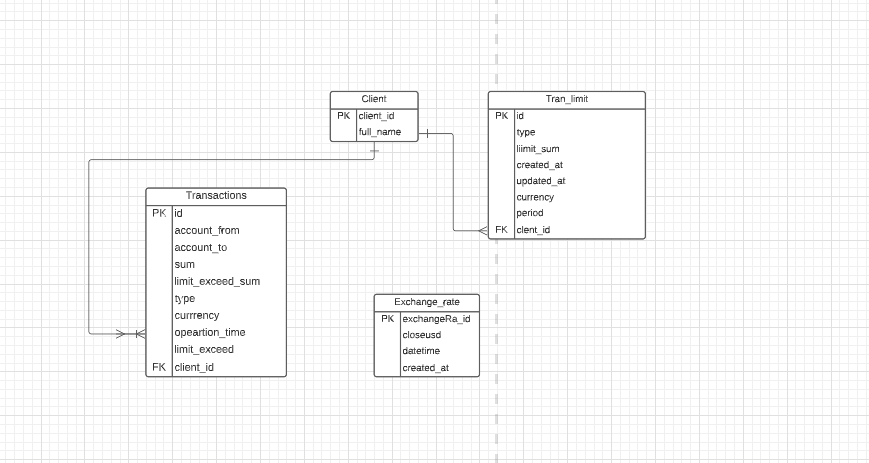
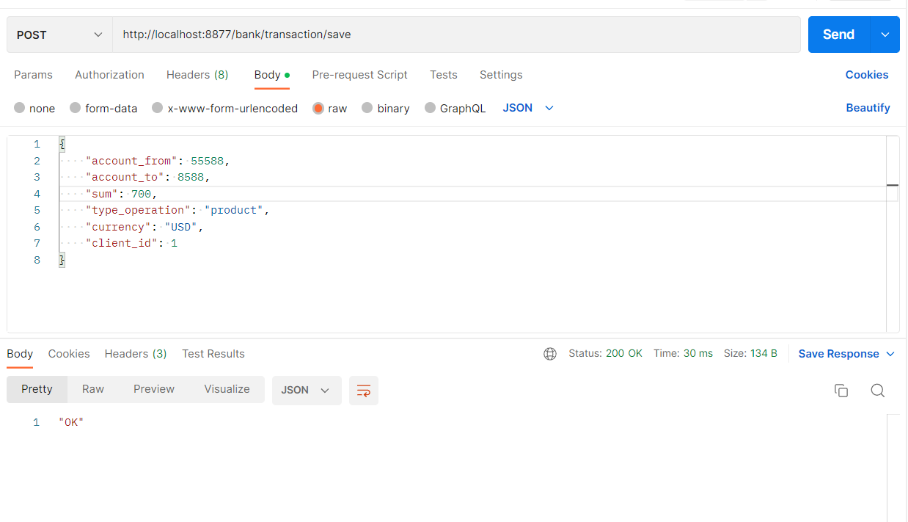
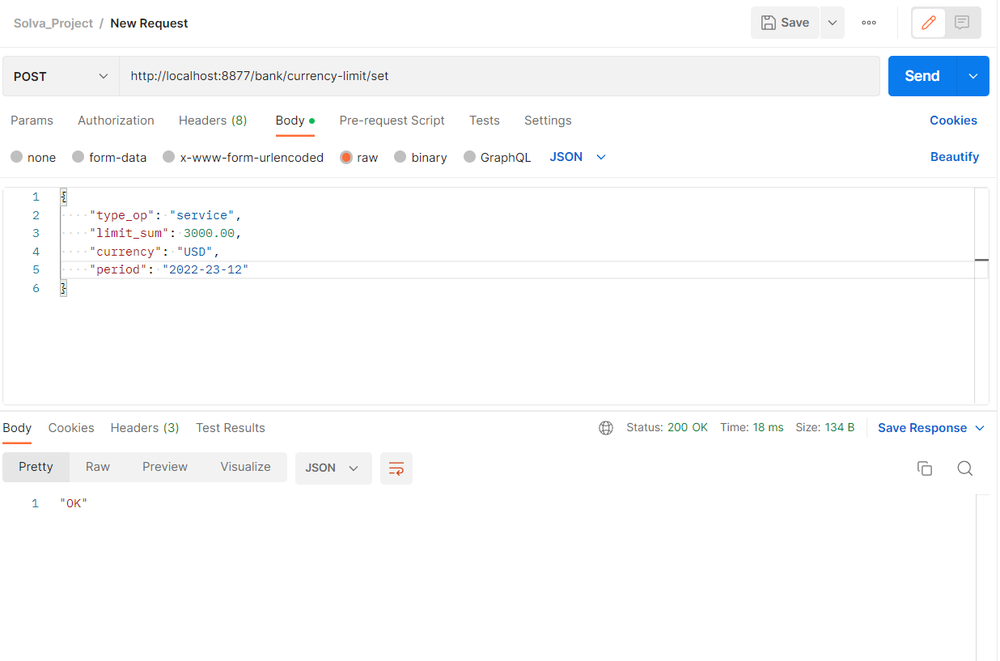
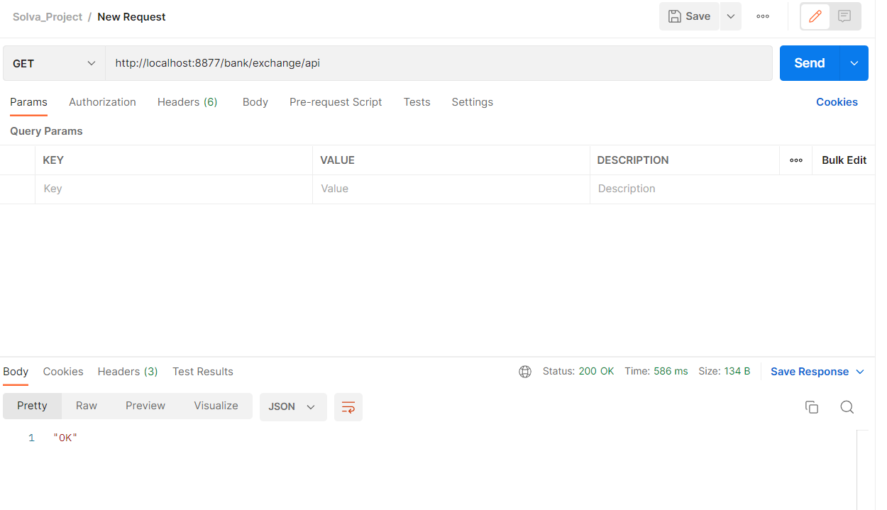
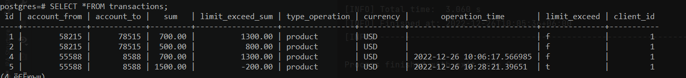
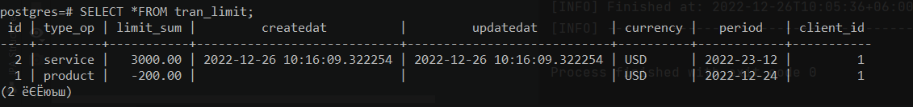
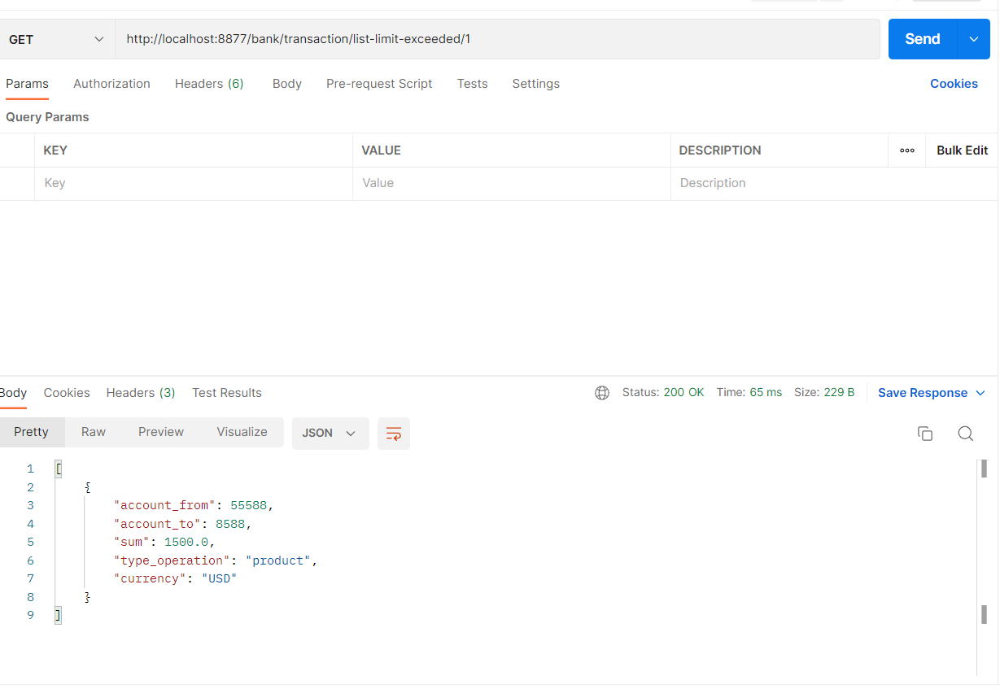

<h1 align="center">Hi there, I'm <a href="https://daniilshat.ru/" target="_blank">Ashimov Yerzhan</a> 
</h1>
<h3 align="center">Goal of Project: Microservice for working with transactions, limits, currency exchange rate</h3>

Using technologies and stacks: 
1) Java 
2) Spring Boot, Cloud, Data
3) Maven
4) HTTP
5) Rest Api
6) Spring cloud
7) Postqre Sql
8) FlyWay
9) Postman
---
<h1>Introduction</h1>

The application consists of several microservices. The main microservice where all the logic is located: "banking-service"

</h1>

<h3>Database</h3>
</h1>

Client > Transaction (ontToMany)

Client > Tran_limit (ontToMany)

Exchange_rate

---
<h1>MainPart</h1>

Port: http://localhost:8877/bank

Task 1: Receive information about each expenditure transaction in tenge (KZT) or rubles (RUB) in real time and save it in your own database (DB)

Save the transaction in the database: http://localhost:8877/bank/transaction/save [POST]

Get information about a transaction using ID: http://localhost:8877/bank/transaction/transaction-list/{id} [GET]

Get information about all client transactions using client_id: http://localhost:8877/bank/transaction/findByClient/{id} [GET]

Task 2:Keep the monthly spending limit in US dollars (USD) separately for two categories of expenses: goods and services. If not set, accept the limit equal to 0

Save the limit in the database: http://localhost:8877/bank/currency-limit/set [POST]

Get all the client's set limits using client_id: http://localhost:8877/bank/currency-limit/all-limit-client/{id} [GET]

Task 3:Request data on exchange rates of the KZT/USD currency pair for a daily interval (1 day/daily) and store them in its own database. When calculating rates, use close data. If they are not available for the current day (it may be the current day within which the auction is taking place, or a day off), then use the data of the last close (previous_close)

Get data using an API and save it in the database: http://localhost:8877/bank/exchange/api [GET]

Get a list of all currencies in the database:: http://localhost:8877/bank/exchange/list-currency [GET]

Task 4:Mark transactions that exceed the monthly transaction limit (technical flag limit_exceeded)

 

Task 5: Enable the client to set a new limit. When setting a new limit, the microservice automatically sets the current date, not allowing it to be set in the past or future time

Set a new limit: http://localhost:8877/bank/currency-limit//update/{id} [PUT] 

I haven't finalized the logic in the service. This task is not completely solved

Task 6: At the request of the client, return a list of transactions that exceeded the limit, indicating the limit that was exceeded (date of establishment, amount of the limit, currency (USD))

 id=client_id

List of transactions that exceeded the limit:  http://localhost:8877/bank/transaction/list-limit-exceeded/{id}

---

<h1>ATTENTION!!!!</h1>

In the future, I want to optimize some part of the code and remove unnecessary codes. And I will finalize task 5 and other microservices. I want the client to dump his data from the client_service microservice. Basically, this service will have a frontend, where we will receive customer data and send it to the main banking service. I would also like to add other APIs such as SOAP/GraphQL

